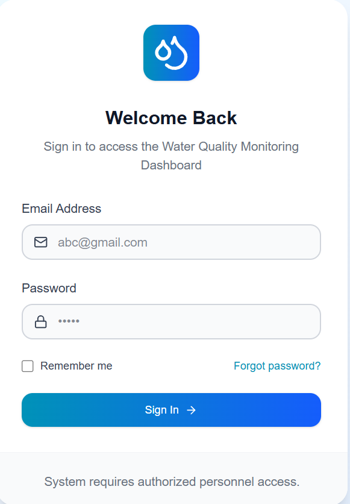
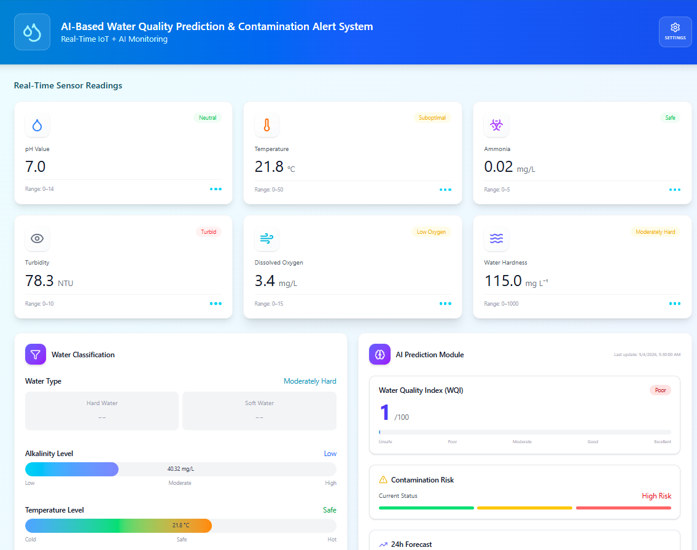

# 🌊 Water Quality Monitoring & Prediction System

> **An AI-Powered Intelligent System for Real-Time Water Quality Monitoring, Predictive Analysis, and Automated Alerting for Aquaculture & Environmental Management**

[](https://www.python.org/)
[](https://flask.palletsprojects.com/)
[](https://react.dev/)
[](https://www.typescriptlang.org/)
[](https://www.mongodb.com/)
[](LICENSE)
[](https://www.docker.com/)

---

## 📋 Mục lục

- [Tổng quan](#tổng-quan)
- [Tính năng nổi bật](#-tính-năng-nổi-bật)
- [Kiến trúc hệ thống](#-kiến-trúc-hệ-thống)
- [Công nghệ sử dụng](#-công-nghệ-sử-dụng)
- [Cài đặt & Chạy](#-cài-đặt--chạy)
- [Cấu trúc dự án](#-cấu-trúc-dự-án)
- [API Documentation](#-api-documentation)
- [Đóng góp](#-đóng-góp)
- [License](#license)

---

## 🎯 Tổng quan

**Water Quality Monitoring & Prediction System** là một nền tảng toàn diện được thiết kế để:

- 📊 **Giám sát thời gian thực** 6 chỉ số quan trọng về chất lượng nước
- 🤖 **Dự đoán bằng AI** tình trạng chất lượng nước trong 24h tới
- 🚨 **Cảnh báo tự động** khi phát hiện vấn đề nghiêm trọng
- 📱 **Dashboard trực quan** với giao diện responsive cho cả desktop & mobile
- 🔒 **Bảo mật cao** với JWT authentication & role-based access control
- ☁️ **Cloud-ready** hỗ trợ containerization với Docker & Docker Compose

Hệ thống được tối ưu cho **nuôi trồng thủy hải sản**, **quản lý môi trường nước**, và **nghiên cứu khoa học**.

---

## 📸 Demo

### Login



### Dashboard



🌐 **Live Demo**: [dadn-jdbj.vercel.app](https://dadn-jdbj.vercel.app/login)

🎥 **Demo Video**: https://www.youtube.com/watch?v=dQw4w9WgXcQ&list=RDdQw4w9WgXcQ&start_radio=1

## ✨ Tính năng nổi bật

### 🔍 Giám sát Thời gian Thực

- **6 chỉ số sinh hóa:** pH, Nhiệt độ, Độ dẫn điện (EC), Độ đục, Oxy hòa tan (DO), Độ cứng
- **Cập nhật liên tục** từ IoT sensors qua microcontroller ESP32
- **Lịch sử dữ liệu** được lưu trữ an toàn trên MongoDB

### 🤖 AI Prediction Engine

- **Random Forest & LSTM models** để dự đoán WQI (Water Quality Index)
- **Phân tích rủi ro ô nhiễm** phân loại thành: Safe, Low Risk, High Risk, Critical
- **Dự báo 24 giờ** với độ chính xác cao
- **Tự động huấn luyện** model khi có dữ liệu mới

### 🚨 Hệ thống Cảnh báo Thông minh

- **Phát hiện tự động** các điều kiện bất thường
- **3 mức độ cảnh báo:** Critical (đỏ), Warning (vàng), Info (xanh)
- **Chống spam thông báo** với logic delay thông minh
- **Gửi email ngay lập tức** cho trường hợp khẩn cấp
- **Dashboard alerts** hiển thị chi tiết và lịch sử

### 👥 Quản lý User & Trạm cảm biến

- **JWT Authentication** an toàn & tiện lợi
- **Role-based Access Control:** Admin, Owner, Viewer
- **Quản lý Trạm cảm biến** - mỗi owner quản lý nhiều trạm
- **Soft delete** - dữ liệu không bị mất vĩnh viễn

### 📈 Phân tích & Biểu đồ

- **Recharts** - Biểu đồ tương tác động đẹp mắt
- **Phân tích xu hướng** theo giờ, ngày, tuần, tháng
- **So sánh giữa các trạm** để tìm ra mẫu hành vi
- **Export dữ liệu** sang CSV hoặc PDF

### 📱 Responsive Design

- **Mobile-first** - Tối ưu hoàn toàn cho thiết bị di động
- **Tailwind CSS** - Styling hiện đại & performant
- **PWA-ready** - Có thể sử dụng offline (lên kế hoạch)

---

## 🏗 Kiến trúc hệ thống

```
┌─────────────────────────────────────────────────────────────────┐
│                    WATER QUALITY MONITORING SYSTEM              │
├─────────────────────────────────────────────────────────────────┤
│                                                                 │
│  IoT SENSORS LAYER                                              │
│  ├─ Temperature (DS18B20)                                       │
│  ├─ Turbidity, DO, pH, NH3, H2S (Analog)                        │
│  └─ 8 Parameters Simulated (BOD, CO2, Alkalinity, ...)          │
│              ↓                                                  │
│  MICROCONTROLLER LAYER (ESP32)                                  │
│  ├─ Data Collection & Preprocessing                             │
│  └─ HTTP POST → Backend API                                     │
│              ↓                                                  │
│  BACKEND LAYER (Flask + Python)                                 │
│  ├─ API Endpoints (REST)                                        │
│  ├─ Authentication (JWT)                                        │
│  ├─ Database (MongoDB)                                          │
│  ├─ AI Models (Random Forest, LSTM)                             │
│  ├─ Alert Service (Email Notifications)                         │
│  └─ Business Logic                                              │
│              ↓                                                  │
│  FRONTEND LAYER (React + TypeScript)                            │
│  ├─ Dashboard UI                                                │
│  ├─ Real-time Charts                                            │
│  ├─ Alert Notifications                                         │
│  └─ User Management                                             │
│              ↓                                                  │
│  USER ACCESS                                                    │
│  ├─ Web Browser (Desktop)                                       │
│  └─ Mobile Browser (Responsive Design)                          │
│                                                                 │
└─────────────────────────────────────────────────────────────────┘
```

---

## 🛠 Công nghệ sử dụng

### Backend Stack

| Thành phần            | Công nghệ                | Phiên bản | Mục đích              |
| --------------------- | ------------------------ | --------- | --------------------- |
| **Ngôn ngữ**          | Python                   | 3.12+     | Core logic            |
| **Framework**         | Flask                    | 3.1+      | Web server & API      |
| **Database**          | MongoDB                  | Latest    | NoSQL storage         |
| **Authentication**    | PyJWT                    | 2.8+      | Token-based auth      |
| **Password Security** | bcrypt                   | 4.0+      | Hash passwords        |
| **Scheduling**        | APScheduler              | 3.10+     | Background tasks      |
| **Async Tasks**       | Celery (optional)        | 5.3+      | Task queue            |
| **AI/ML**             | scikit-learn, TensorFlow | Latest    | Prediction models     |
| **Email**             | SMTP (Gmail)             | -         | Alert notifications   |
| **CORS**              | Flask-CORS               | 4.0+      | Cross-origin requests |

### Frontend Stack

| Thành phần           | Công nghệ    | Phiên bản | Mục đích             |
| -------------------- | ------------ | --------- | -------------------- |
| **Ngôn ngữ**         | TypeScript   | 5.0+      | Type-safe JS         |
| **Framework**        | React        | 18+       | UI component library |
| **Build Tool**       | Vite         | 5.0+      | Fast bundler         |
| **Styling**          | Tailwind CSS | 3.0+      | Utility-first CSS    |
| **Charts**           | Recharts     | 2.10+     | Interactive charts   |
| **Icons**            | Lucide React | 0.2+      | Icon library         |
| **HTTP Client**      | Axios        | 1.6+      | API requests         |
| **State Management** | Context API  | -         | Global state         |
| **Deployment**       | Vercel       | -         | Hosting platform     |

### Firmware Stack

| Thành phần          | Công nghệ        | Mục đích                |
| ------------------- | ---------------- | ----------------------- |
| **Microcontroller** | ESP32            | IoT device              |
| **IDE**             | PlatformIO       | Development environment |
| **Protocol**        | WiFi + MQTT/HTTP | Communication           |
| **Libraries**       | OneWire, Wire    | Sensor communication    |

### DevOps & Deployment

- **Docker** - Containerization
- **Docker Compose** - Multi-container orchestration
- **GitHub** - Version control
- **Vercel** - Frontend deployment
- **Cloud Platforms** - AWS/GCP/Azure (ready for deployment)

---

## 🚀 Cài đặt & Chạy

### 📋 Yêu cầu Hệ thống

- **Python 3.12+** (cho Backend)
- **Node.js 18+** (cho Frontend)
- **MongoDB** (Local hoặc Cloud)
- **Docker & Docker Compose** (optional, nhưng recommended)
- **Git**

### Option 1: Cài đặt Local (Không dùng Docker)

#### Backend Setup

```bash
# Di chuyển vào thư mục backend
cd be

# Tạo virtual environment
python -m venv .venv

# Activate virtual environment
# On Windows:
.venv\Scripts\activate
# On macOS/Linux:
source .venv/bin/activate

# Cài đặt dependencies
pip install -r requirements.txt

# Cấu hình biến môi trường
# Tạo file .env theo .env.example (nếu có)

# Chạy server
python run.py
# Server sẽ chạy tại: http://127.0.0.1:5000
```

#### Frontend Setup

```bash
# Di chuyển vào thư mục frontend
cd fe

# Cài đặt dependencies
npm install

# Chạy development server
npm run dev
# Frontend sẽ chạy tại: http://localhost:5173

# Build cho production
npm run build

# Preview production build
npm run preview
```

**Biến môi trường cần thiết (.env):**

```bash
# Flask
FLASK_ENV=development
FLASK_APP=run.py
SECRET_KEY=your-secret-key-here

# MongoDB
MONGO_URI=mongodb://localhost:27017/water_quality

# JWT
JWT_SECRET_KEY=your-jwt-secret-key
JWT_ALGORITHM=HS256
JWT_EXPIRATION=86400  # 24 hours

# Email (Gmail SMTP)
SMTP_SERVER=smtp.gmail.com
SMTP_PORT=587
EMAIL_USER=your-email@gmail.com
EMAIL_PASSWORD=your-app-password  # Use App Password, not regular password
ALERT_EMAIL_RECIPIENT=alert@example.com

# AI Model Path
MODEL_PATH=./services/modelsAI/

# CORS
CORS_ORIGINS=http://localhost:5173,http://localhost:3000
```

### Option 2: Cài đặt với Docker Compose (Recommended)

```bash
# Ở root directory của dự án
# Đảm bảo file docker-compose.yml tồn tại

# Build và chạy tất cả services
docker-compose up -d

# Xem logs
docker-compose logs -f

# Dừng services
docker-compose down

# URLs sau khi chạy:
# Frontend: http://localhost:3000
# Backend: http://localhost:5000
# MongoDB: localhost:27017
```

**docker-compose.yml** sẽ chứa:

- MongoDB service
- Backend service (Flask)
- Frontend service (React)

---

## 📂 Cấu trúc dự án

```
DADN/
├── 📄 README.md                    # Tài liệu dự án (file này)
├── 📄 docker-compose.yml           # Docker Compose config
│
├── 📁 be/                          # Backend (Flask + Python)
│   ├── 📄 run.py                   # Entry point
│   ├── 📄 requirements.txt         # Python dependencies
│   ├── 📄 Dockerfile               # Docker image config
│   ├── 📄 .env.example             # Environment variables template
│   │
│   └── 📁 app/
│       ├── 📄 __init__.py          # Flask app initialization
│       ├── 📄 config.py            # Configuration settings
│       │
│       ├── 📁 application/         # Business Logic Layer (Clean Architecture)
│       │   ├── 📁 auth/            # Authentication use cases
│       │   │   ├── commands.py     # Auth commands
│       │   │   ├── use_cases.py    # Auth logic
│       │   │   └── interfaces.py   # Contracts
│       │   │
│       │   ├── 📁 sensor_station/  # Sensor station management
│       │   │   ├── commands.py
│       │   │   ├── use_cases.py
│       │   │   └── sensor_data_*   # Sensor data specific
│       │   │
│       │   ├── 📁 common/          # Shared utilities
│       │   │   ├── exceptions.py   # Custom exceptions
│       │   │   ├── models.py       # Common models
│       │   │   └── interfaces/     # Base interfaces
│       │   │
│       │   └── 📁 prediction/      # AI prediction logic
│       │
│       ├── 📁 domain/              # Domain Layer (Business Rules)
│       │   ├── 📁 auth/            # User domain model
│       │   ├── 📁 sensor_station/  # Sensor station model
│       │   ├── 📁 prediction/      # Prediction model
│       │   └── 📁 shared/          # Shared domain objects
│       │
│       ├── 📁 infrastructure/      # Infrastructure Layer
│       │   ├── 📁 persistence/     # Database operations
│       │   │   └── 📁 mongo/       # MongoDB repositories
│       │   ├── 📁 security/        # Security implementations
│       │   │   ├── bcrypt_password_hasher.py
│       │   │   └── jwt_token_service.py
│       │   └── 📁 external/        # External services
│       │       └── weather_service.py
│       │
│       ├── 📁 presentation/        # Presentation Layer (API)
│       │   └── 📁 http/            # HTTP routes
│       │
│       ├── 📁 routes/              # API endpoints
│       │   ├── alert_routes.py     # Alert management endpoints
│       │   ├── prediction_routes.py # Prediction endpoints
│       │   └── ...
│       │
│       ├── 📁 services/            # Business services
│       │   ├── ai_model_service.py           # AI model wrapper
│       │   ├── alert_service.py              # Alert logic
│       │   ├── sensor_health_service.py      # Sensor health check
│       │   ├── solution_ai_service.py        # AI solutions
│       │   └── 📁 modelsAI/                  # AI models & data
│       │       ├── good_water_profile.json   # Training data
│       │       └── *.pkl, *.h5               # Model files
│       │
│       ├── 📁 middleware/          # Express middleware
│       ├── 📁 models/              # Data models
│       ├── 📁 database/            # Database config
│       ├── 📁 utils/               # Utility functions
│       └── 📁 bootstrap/           # Dependency injection
│           └── container.py        # Service container
│
├── 📁 fe/                          # Frontend (React + Vite)
│   ├── 📄 package.json             # Node dependencies
│   ├── 📄 tsconfig.json            # TypeScript config
│   ├── 📄 vite.config.ts           # Vite config
│   ├── 📄 tailwind.config.js        # Tailwind CSS config
│   ├── 📄 Dockerfile               # Docker image config
│   ├── 📄 index.html               # HTML entry point
│   │
│   └── 📁 src/
│       ├── 📄 main.tsx             # React entry point
│       ├── 📄 App.tsx              # Root component
│       ├── 📄 index.css            # Global styles
│       │
│       ├── 📁 pages/               # Page components
│       │   ├── LoginPage.tsx        # Authentication
│       │   ├── DashboardPage.tsx    # Main dashboard
│       │   └── AdminPage.tsx        # Admin management
│       │
│       ├── 📁 components/          # Reusable components
│       │   ├── Header.tsx          # Top navigation
│       │   ├── Footer.tsx          # Bottom footer
│       │   ├── SensorCard.tsx      # Sensor display
│       │   ├── TrendCharts.tsx     # Charts visualization
│       │   ├── MapVisualization.tsx # Map component
│       │   ├── AlertsPanel.tsx     # Alert display
│       │   ├── Predict.tsx         # Prediction interface
│       │   ├── WaterClassificationPanel.tsx
│       │   ├── AIPredictionPanel.tsx
│       │   ├── SystemArchitecture.tsx
│       │   └── 📁 ui/              # UI components
│       │       ├── Button.tsx
│       │       ├── Card.tsx
│       │       ├── Modal.tsx
│       │       └── ...
│       │
│       ├── 📁 services/            # API services
│       │   ├── api.ts              # Axios instance
│       │   └── authService.ts      # Auth logic
│       │
│       ├── 📁 types/               # TypeScript interfaces
│       │   └── water.ts            # Water quality types
│       │
│       ├── 📁 styles/              # Global styles
│       │   └── globals.css
│       │
│       ├── 📁 guidelines/          # Documentation
│       │   └── Guidelines.md
│       │
│       └── 📁 imports/             # Asset imports
│
├── 📁 firmware/                    # IoT Firmware (Arduino/PlatformIO)
│   ├── 📄 platformio.ini           # PlatformIO config
│   ├── 📄 README.md                # Firmware documentation
│   │
│   └── 📁 src/
│       └── water_quality.ino       # Main firmware code
│
└── 📁 .github/                     # GitHub config
        └── 📁 workflows/               # CI/CD pipelines
                └── deploy.yml              # Deployment workflow
```

---

## 🔌 API Documentation

### Base URL

```
http://localhost:5000/api/v1
```

### Authentication Endpoints

#### Login

```http
POST /auth/login
Content-Type: application/json

{
    "email": "user@example.com",
    "password": "password123"
}

Response (200):
{
    "access_token": "eyJhbGciOiJIUzI1NiIs...",
    "user": {
        "id": "123",
        "email": "user@example.com",
        "role": "owner"
    }
}
```

#### Register

```http
POST /auth/register
Content-Type: application/json

{
    "email": "newuser@example.com",
    "password": "password123",
    "full_name": "John Doe"
}

Response (201): User created successfully
```

### Sensor Station Endpoints

#### Get All Stations

```http
GET /sensor-stations
Authorization: Bearer {token}

Response (200):
[
    {
        "id": "station_123",
        "name": "Pond 1",
        "location": "Farm A",
        "sensors": 6,
        "last_updated": "2024-01-15T10:30:00Z"
    }
]
```

#### Get Sensor Data

```http
GET /sensor-stations/{station_id}/data?from=2024-01-01&to=2024-01-31
Authorization: Bearer {token}

Response (200):
[
    {
        "timestamp": "2024-01-15T10:30:00Z",
        "pH": 7.2,
        "temperature": 28.5,
        "EC": 1200,
        "turbidity": 15,
        "DO": 8.5,
        "hardness": 150
    }
]
```

### Alert Endpoints

#### Get Alerts

```http
GET /alerts?level=critical
Authorization: Bearer {token}

Query Parameters:
- level: critical | warning | info
- from: ISO timestamp
- to: ISO timestamp

Response (200):
[
    {
        "id": "alert_123",
        "level": "critical",
        "message": "Water pH is too low",
        "sensor_station": "Pond 1",
        "created_at": "2024-01-15T10:30:00Z",
        "read": false
    }
]
```

#### Mark Alert as Read

```http
PUT /alerts/{alert_id}/read
Authorization: Bearer {token}

Response (200): Alert marked as read
```

### Prediction Endpoints

#### Get WQI Prediction

```http
GET /predictions/{station_id}/wqi
Authorization: Bearer {token}

Query Parameters:
- hours: 24 (default: next 24 hours)

Response (200):
{
    "station_id": "station_123",
    "predicted_wqi": 75,
    "risk_level": "Low Risk",
    "predicted_at": "2024-01-15T10:30:00Z",
    "forecast": [
        { "hour": 1, "wqi": 75 },
        { "hour": 2, "wqi": 74 },
        ...
    ]
}
```

---

## 🧪 Testing

### Backend Testing

```bash
cd be

# Chạy unit tests
pytest tests/

# Chạy với coverage
pytest tests/ --cov=app --cov-report=html
```

### Frontend Testing

```bash
cd fe

# Chạy component tests
npm run test

# Chạy E2E tests
npm run test:e2e
```

---

## 🔒 Bảo mật

### Best Practices Đã Áp Dụng

- ✅ **JWT Authentication** - Stateless, secure token-based auth
- ✅ **Password Hashing** - bcrypt với salt rounds
- ✅ **CORS Configuration** - Chỉ allow origins được phép
- ✅ **Environment Variables** - Sensitive data không hardcode
- ✅ **SQL/NoSQL Injection Prevention** - Parameterized queries
- ✅ **Rate Limiting** - Prevent brute force attacks
- ✅ **HTTPS** - Sử dụng trong production
- ✅ **Soft Delete** - Không xóa dữ liệu vĩnh viễn

### Bảo mật IoT

- 🔐 **Device Authentication** - Token validation cho ESP32
- 🔐 **Data Encryption** - HTTPS cho API calls
- 🔐 **Firmware Updates** - Secure OTA updates

---

## 📊 Monitoring & Logging

- **Backend Logs** - Flask logging to console & file
- **Database Monitoring** - MongoDB Atlas monitoring
- **Application Metrics** - Track API response times & errors
- **Error Tracking** - Sentry integration (optional)

---

## 🤝 Đóng góp

Chúng tôi hoan nghênh mọi đóng góp! Vui lòng:

1. **Fork** repository này
2. **Tạo feature branch**
    ```bash
    git checkout -b feature/AmazingFeature
    ```
3. **Commit changes**
    ```bash
    git commit -m 'Add some AmazingFeature'
    ```
4. **Push to branch**
    ```bash
    git push origin feature/AmazingFeature
    ```
5. **Open Pull Request**

### Coding Standards

- **Python**: PEP 8 compliance
- **TypeScript/React**: ESLint & Prettier formatting
- **Commit messages**: Conventional commits
- **Documentation**: Always update README & code comments

---

## 📝 Roadmap

### Version 1.0 (Current)

- ✅ Core monitoring system
- ✅ Basic AI predictions
- ✅ Alert notifications
- ✅ Web dashboard

### Version 2.0 (Planned)

- 🔄 Mobile app (React Native)
- 🔄 Advanced analytics & reporting
- 🔄 Multi-language support
- 🔄 Offline mode with sync
- 🔄 Data export (Excel, PDF)

### Version 3.0 (Future)

- 🔭 ML model improvements
- 🔭 Automated recommendations
- 🔭 IoT device management
- 🔭 API marketplace

---

## ❓ FAQ

### Q: Làm sao để thay đổi ngưỡng cảnh báo?

**A:** Chỉnh sửa file `be/app/services/alert_service.py` - phần `ALERT_THRESHOLDS`

### Q: Tôi có thể sử dụng database khác ngoài MongoDB không?

**A:** Có, thay đổi MongoDB driver bằng bất kỳ database ORM nào (SQLAlchemy, etc.)

### Q: Làm sao để deploy lên production?

**A:** Xem [DEPLOYMENT.md](./DEPLOYMENT.md) (tạo file này nếu cần)

### Q: Model AI được huấn luyện trên dữ liệu nào?

**A:** File `be/services/modelsAI/good_water_profile.json` chứa training data

---

## 📞 Liên hệ & Support

- 📧 **Email**: your-email@example.com
- 💬 **Issues**: [GitHub Issues](https://github.com/your-repo/issues)
- 📚 **Documentation**: [Wiki](https://github.com/your-repo/wiki)
- 🐛 **Bug Report**: Vui lòng tạo GitHub issue

---

## 📄 License

Dự án này được cấp phép dưới [MIT License](LICENSE) - xem file [LICENSE](LICENSE) để biết chi tiết.

---

## 🎓 Credits & Acknowledgments

- **Team Members**: DADN students - HCMUT
- **Advisors**: Faculty advisors & mentors
- **Technologies**: Flask, React, MongoDB, TensorFlow, scikit-learn
- **Icons & Design**: Lucide React, Tailwind CSS
- **Inspiration**: Best practices from open-source projects

---

## 📈 Project Statistics

```
Language          Files       Lines of Code     Est. Build Time
──────────────────────────────────────────────────────────────
Python            ~30         ~5,000+           ~5 min
TypeScript/React  ~25         ~3,500+           ~3 min
Arduino/C++       ~2          ~1,500+           ~2 min
──────────────────────────────────────────────────────────────
TOTAL             ~57         ~10,000+          ~10 min
```

---

<div align="center">

**Made with ❤️ by DADN Team**

⭐ If you find this project helpful, please give it a star!

[⬆ Back to Top](#-water-quality-monitoring--prediction-system)

</div>
